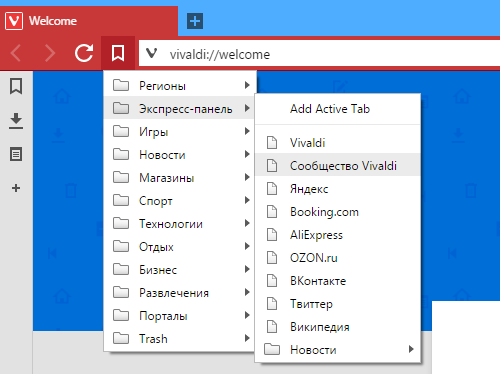
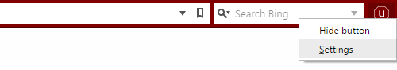
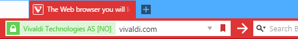
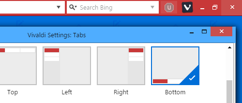
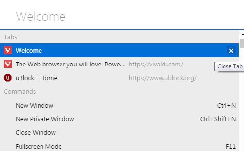
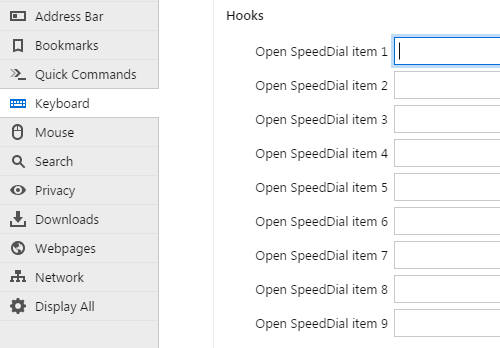
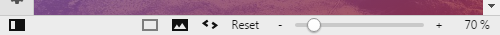
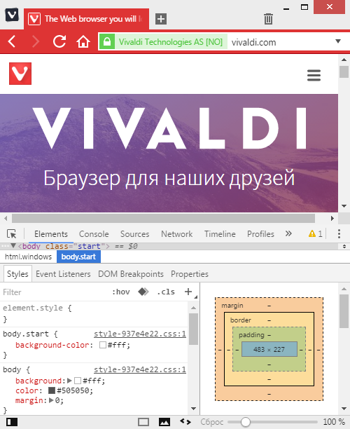
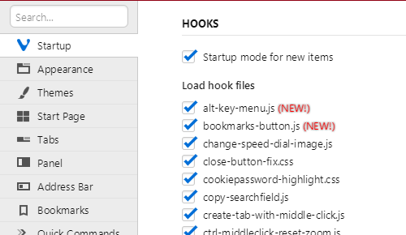
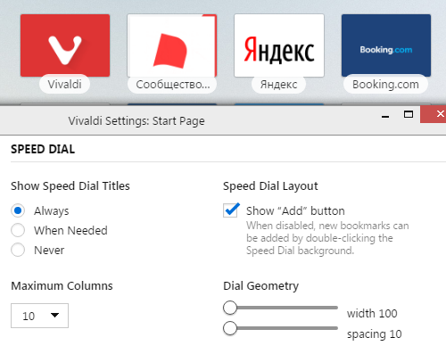

# VivaldiHooks

## About
VivaldiHooks is a set of hooks/scripts for Vivaldi browser modding.

It's something close to [VivaldiPatches](https://github.com/justdanpo/VivaldiPatches) but it has some advantages:

- there is no need to add every mod (css/javascript) into **browser.html**: only **jdhooks.js** should be added there, other files are loaded automatically
- hook scripts are almost Vivaldi-version independent -> there is no need to port mods to every new Vivaldi version
- there is no need to interact with minified code; this means more complex mods may be done easier; also javascript mods look much more readable than patches

But some of mods cannot be implemented as hooks, so I don't bury VivaldiPatches.

## Installation
### Automatic (Windows only)
Just run **installhooks.bat**. It will find installation path automatically if Vivaldi is set as your default browser.

If Vivaldi is installed in "Program Files" or any other write-restricted folder, you must run the script as Administrator.

You may specify a path in a command line:

    installhooks.bat C:\programz\Vivaldi-snapshots\1.5.609.8\Application
    installhooks.bat "C:\some path with spaces\Vivaldi\Application"

Another easy way: drag Vivaldi directory and drop it on **installhooks.bat**.

~~Note: **browser.html** will be overwritten.~~

### Manual

First of all, find Vivaldi installation folder (**{instdir}**):

- Windows: `Vivaldi\Application\{version}\resources`
- Linux: `/opt/vivaldi/resources` or `/opt/vivaldi-snapshot/resources`
- MacOS: `/Applications/Vivaldi.app/Contents/Versions/{version}/Vivaldi Framework.framework/Resources`

Copy **vivaldi** folder into **{instdir}**

Or if you want to keep mods you've installed into **browser.html**, copy **vivaldi\hooks** folder and **vivaldi\jdhooks.js** into **{instdir}\vivaldi**, open **{instdir}\vivaldi\browser.html** in a text editor, add line

    

right before a line with **bundle.js**.

You may need to chmod new/updated files.

## Deinstallation

If some hooks cause Vivaldi to crash, you can remove just hook files.

The easiest way to "uninstall"/disable VivaldiHooks is to delete **{instdir}\vivaldi\jdhooks.js**.

## Screenshots

### [bookmarks-button.js](vivaldi/hooks/bookmarks-button.js)

### [extensions-buttons-menu-settings.js](vivaldi/hooks/extensions-buttons-menu-settings.js)

### [go-button.js](vivaldi/hooks/go-button.js)

### [move-window-buttons-maximized.js](vivaldi/hooks/move-window-buttons-maximized.js)

### [qc-close-tab.js](vivaldi/hooks/qc-close-tab.js)

### [speeddial-shortcuts.js](vivaldi/hooks/speeddial-shortcuts.js)

### [zoom-buttons.js](vivaldi/hooks/zoom-buttons.js)

### [searchfield-current-engine-icon.js](vivaldi/hooks/searchfield-current-engine-icon.js)

### [devtools.js](vivaldi/hooks/devtools.js)

### [jdhooks-startup-settings.js](vivaldi/hooks/jdhooks-startup-settings.js)

### [speeddial-items-geometry.js](vivaldi/hooks/speeddial-items-geometry.js)

